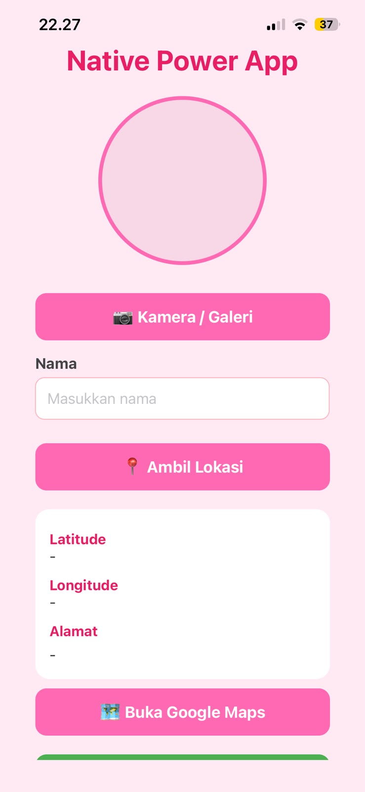
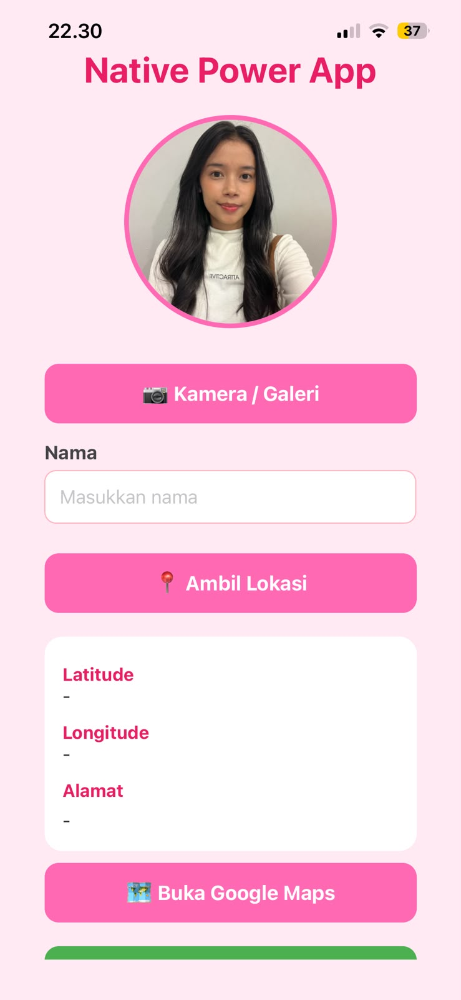
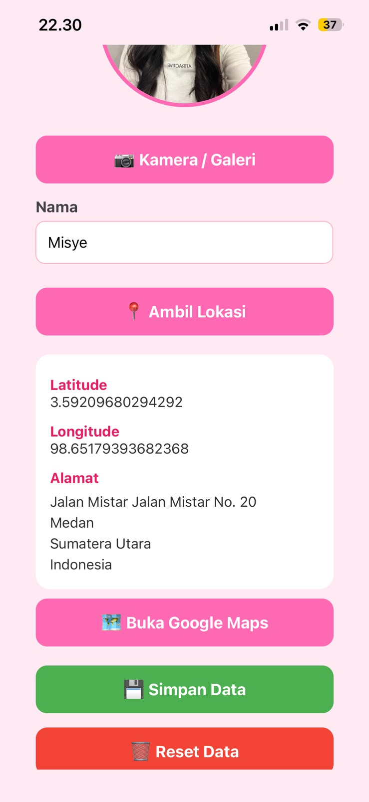
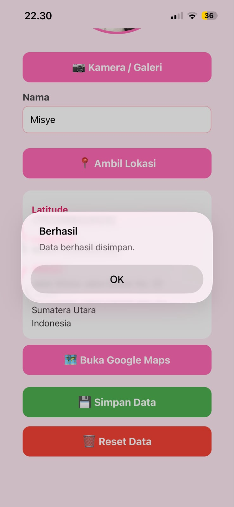

# 📱 Native Power App

Native Power App adalah aplikasi mobile berbasis **React Native** dan **Expo SDK 54** yang memanfaatkan fitur native smartphone seperti **Kamera**, **Galeri**, **GPS**, **AsyncStorage**, dan **Google Maps**. Aplikasi ini dibuat untuk memenuhi tugas **Mission: Native Power App** pada mata kuliah Mobile Programming.

---

## ✨ Fitur Utama

### ✅ Level 1 (Core Features)

- Mengambil foto menggunakan kamera.
- Memilih foto dari galeri.
- Permission Flow untuk Kamera, Galeri, dan Lokasi.
- Menampilkan foto hasil pengambilan.
- Mengambil koordinat GPS (Latitude & Longitude).
- Menampilkan alamat menggunakan Reverse Geocoding.
- Menampilkan pesan Alert ketika izin ditolak sehingga aplikasi tidak mengalami crash.

---

### ✅ Level 2 (Development Features)

- Kamera dan Galeri dalam satu pilihan (Alert Dialog).
- Menyimpan data menggunakan AsyncStorage.
- Membuka lokasi menggunakan Google Maps.
- Tombol menuju Settings ketika permission ditolak.

---

## 📱 Tampilan Aplikasi

### Halaman Awal



### Mengambil Foto



### Mengambil Lokasi



### Data Berhasil Disimpan



---

## 🛠️ Teknologi yang Digunakan

- React Native
- Expo SDK 54
- JavaScript
- Expo Image Picker
- Expo Location
- AsyncStorage
- React Native Linking

---

## 📂 Struktur Project

```
NativePowerApp
│
├── assets/
├── App.js
├── app.json
├── package.json
├── Pag1.jpeg
├── Pag2.jpeg
├── Pag3.jpeg
├── Pag4.jpeg
└── README.md
```

---

## ▶️ Cara Menjalankan

Clone repository:

```bash
git clone https://github.com/misyesinaga1-alt/NativePowerApp.git
```

Masuk ke folder project:

```bash
cd NativePowerApp
```

Install dependency:

```bash
npm install
```

Jalankan aplikasi:

```bash
npx expo start
```

Scan QR Code menggunakan aplikasi **Expo Go** pada perangkat Android atau iOS.

---

## 📌 Permission yang Digunakan

- Kamera
- Galeri
- Lokasi (GPS)

Permission akan diminta ketika pengguna pertama kali mengakses fitur yang membutuhkan izin.

---

## 📦 Penyimpanan Data

Aplikasi menggunakan **AsyncStorage** untuk menyimpan:

- Nama pengguna
- Foto profil
- Latitude
- Longitude
- Alamat

Data akan tetap tersimpan meskipun aplikasi ditutup.

---

## 📍 Google Maps

Aplikasi menyediakan tombol **Buka Google Maps** untuk membuka koordinat lokasi pengguna langsung pada aplikasi Google Maps.

---

## 🔗 Repository GitHub

Repository dapat diakses melalui:

**https://github.com/misyesinaga1-alt/NativePowerApp**

---

## 🍿 Expo Snack


🔗 https://snack.expo.dev/@misyesinaga/nativepowerapp
```

---

## 👩‍💻 Author

**Misye Retno Wulansari Br. Sinaga**

---

### 🎯 Hasil Pencapaian

✔ Permission Flow

✔ Kamera

✔ Galeri

✔ GPS

✔ Reverse Geocoding

✔ AsyncStorage

✔ Google Maps

✔ Open Settings

✔ Expo SDK 54

✔ React Native
